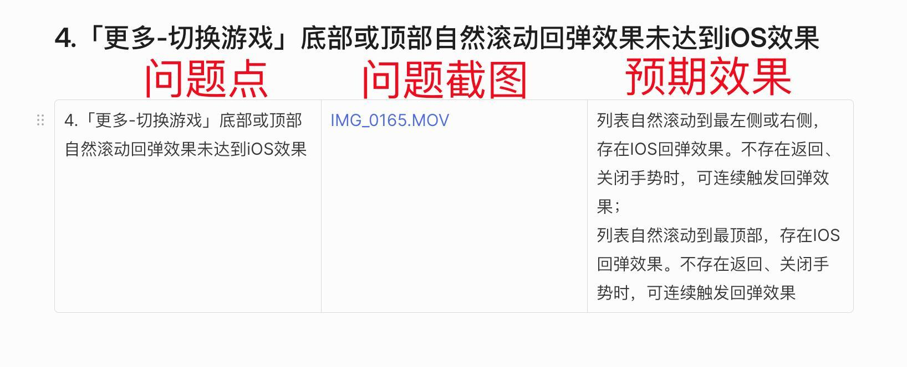

# GameSdk

## 架构

### 流程图


### 类图


### 时序图


## Linear

### 问题说明

 

### 提交规范

#### 关键词

提交commit时，请指明提交的关键词。关键词如下：

> feat：特性
>
> bugfix：bug修复
>
> reactor：重构

例：

```shell
bugfix:
1. 在「更多-切换游戏」里每个游戏之间的上下间距与UI设计图不一致，且字段缺少“在线” #35
2. 「更多-帮助」弹窗下滑消失动画速度较快（未达到iOS效果）#42
3. 对筹码,DrawHistory使用OverScrollDecoratorHelper增加弹性动画
```


- 参考：

  

#### 原子化条提交

每次改动一次commit，尽量做到每次提交是原子化不可拆分


### 完成bug的参考格式

```xml
原因：

解法：

结果：
```

例：

   


