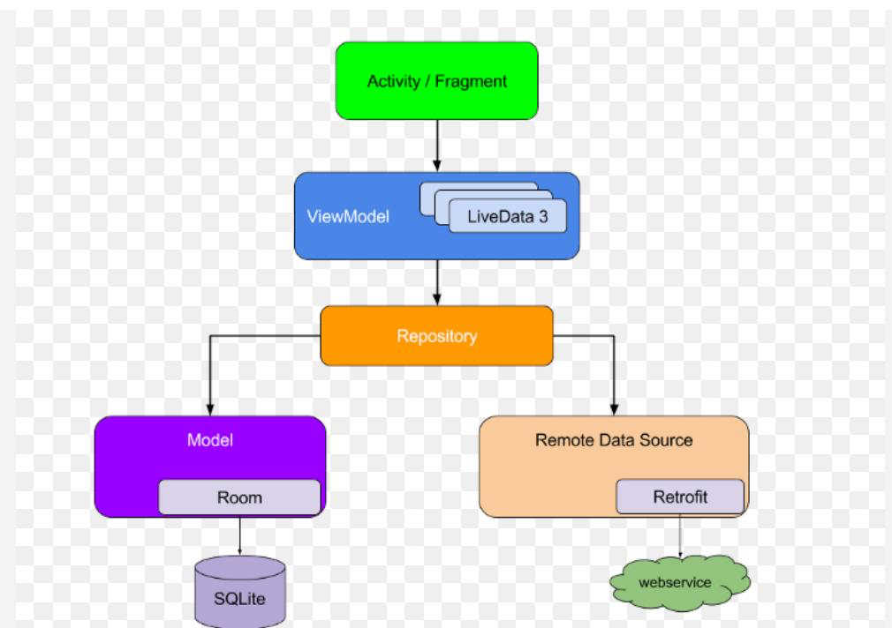

# wls-android

## 开发文档
// c端产品文档【更新：2025-03-05】
https://87if81.axshare.com/?g=4

// figma地址
https://www.figma.com/design/TiXWlyqWAI4iSddgSyz7pm/WaliSport_2.0?node-id=0-1&m=dev

// 赛事表情文案
https://docs.google.com/document/d/1Rulz2SN8m1P3PTh_gNM7FDTzO9p_jGO3QMJ_v2WWAA4/edit?tab=t.0#heading=h.yzuwzne9ughj

// 动画效果及体验需求文档
https://docs.google.com/spreadsheets/d/1fRuB82X0Fmsgi54u52gEWbAgxl5t8CzJVqGr1USDn0c/edit?usp=sharing

## 模块

### 模块划分
- 注： 模块命名规则为，库以"lib_"开头，业务模块以"module_"开头

| **模块**        | **名字** | **解释** |
|-----------------|--------|--------|
| lib_base        | 基础库    | 基类     |
| lib_common      | 通用库    | 业务共用类  |
| module_login    | 登录模块   | 登录业务   |
| module_home     | 首页模块   | 首页业务   |
| module_setting  | 设置模块   | 设置业务   |

### 模块初始化
模块需要在Application启动时，初始化自己的工作，通过[Jetpack Startup](https://developer.android.com/topic/libraries/app-startup?hl=zh-cn)组件实现

### 目录划分

以module_setting举例，其他模块目录仿照此风格
```text
module_setting/
├── data/                              # 数据层，负责数据获取和存储
│   ├── api/                          # 接口定义（网络请求API）
│   │   └── SettingApi.kt
│   ├── repo/                         # 仓库，封装数据来源
│   │   └── SettingRepository.kt
│   ├── model/                        # 数据模型（实体类）
│   │   └── SettingBean.kt
│   ├── constants/                    # 常量和枚举配置
│   │   ├── SettingEnum.kt           # 枚举类
│   │   └── SettingConstant.kt       # 常量类
│   └── manager/                     # 管理类，封装模块状态/缓存/策略等
│       └── SettingManager.kt

├── ui/                               # 界面层，包含所有UI组件
│   ├── activity/                    # Activity 页面
│   ├── fragment/                    # Fragment 页面
│   ├── dialog/                      # 弹窗组件
│   ├── view/                        # 自定义View组件
│   ├── adapter/                     # 列表适配器
│   │   ├── SettingAdapter.kt
│   │   └── SettingViewHolder.kt
│   └── viewmodel/                   # ViewModel，负责界面数据状态管理

├── utils/                            # 通用工具类与扩展函数（无状态）
│   ├── ext/                         # Kotlin 扩展函数目录
│   │   └── StringExt.kt
│   ├── ThreadUtils.kt               # 线程调度相关
│   └── helper/                      # 助手类，封装通用逻辑
│       ├── CountDownHelper.kt       # 倒计时辅助类
│       └── ToastHelper.kt           # Toast 弹窗辅助类

├── service/                          # 模块对外能力与通信服务
│   ├── ISettingService.kt           # 服务接口定义（对外暴露）
│   ├── SettingServiceImpl.kt        # 服务实现
│   ├── SettingProvider.kt           # 内容提供者
│   └── SettingBroadcastReceiver.kt  # 广播接收器

├── SettingModuleInitializer.kt       # 模块初始化类，负责模块的初始化

```

### mvvm架构


https://hackmd.io/@LinkHsieh/HkcXg8Shkx

## 规范

### 命名
业务模块使用"module_"，库模块使用"lib_"

### UI层只与ViewModel交互

⚠️   
UI層不要有資料層的東西注入   
也不應該有資料的業務邏輯


## Todo
### 方案讨论
1. Activity之间通信选用什么？ ARouter,EventBus or else?   
```text
使用Navigation
```
2. Fragment之间通信选用什么？ Navigation or else？  
```text
使用Navigation
```
[NavigationTutuorial.md](./z_doc/NavigationTutorial)

3. 通用的标题栏样式? 需要内置到BaseActivity,BaseFragment中吗？
```text

```
4. 沉浸式标题栏方案？
```text
使用ImmersionBar
1:IStatusBar.Config态栏参数
2:StatusBarDelegate.setStatusBar()设置状态栏
```
5. 加载Activity/Fragment统一的Loading框，错误框，空白框内置到BaseActivity,BaseFragment中吗？
```text

```
6. 换肤方案？SkinCompat, AppCompat or else?
```text

```
7. 直播设计：选用SurfaceView , TextureView or else?
```text

```
9. 直播的弹幕设计：TextView or else?
```text

```
10. 直播的礼物特效设计： Animation or Lottie ?
```text

```
11. 消息推送设计： Netty or WebSocket？
```text
WebSocket
```
12. 自定义title：所有标题继承于TitleBarView
```text
通用title
 /**
     * 通用标题 loadGeneralTitleBar()
     * @param titleName 标题名称
     * @param callback 返回
     */

搜索title
 /**
     * 搜索标题 loadSearchTitleBar()
     * @param hintText 搜索框提示
     * @param callback 返回
     * @param callbackSearch 搜索
     */

动态title loadDynamicsTitleBar()
 /**
     * 搜索标题
     * @param view 传入布局view
     * @param callback 返回 不传入Unit 默认不显示ivBack 
     */

```