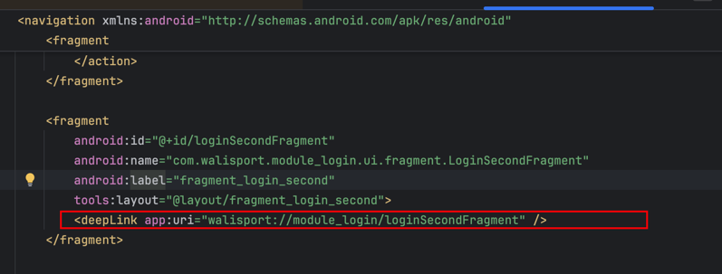
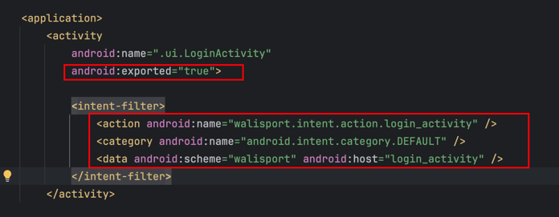
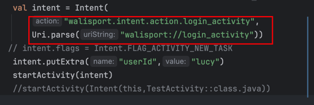
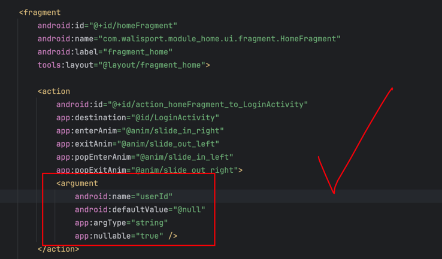
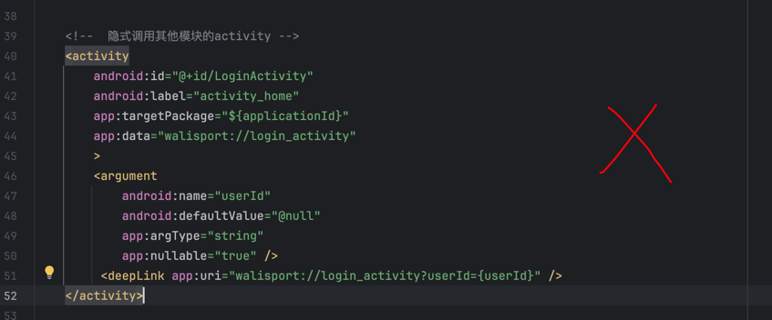

## 1. app模块集成其他模块

- (1) app模块需要一个NavHostActivity来加载依赖模块的nav_graph，这样才能实现模块间路由   

- (2) NavHostActivity的nav_graph需要include所有module的nav_graph
```xml
<navigation xmlns:android="http://schemas.android.com/apk/res/android"
    xmlns:app="http://schemas.android.com/apk/res-auto"
    android:id="@+id/nav_graph_app"
    app:startDestination="@id/nav_graph_home">

    <include app:graph="@navigation/home_nav_graph" />
    <include app:graph="@navigation/login_nav_graph" />
    <include app:graph="@navigation/setting_nav_graph" />
```

- (3) 命名规范(建议): '模块名_nav_graph'
建议一个Activity，多个fragment。

## 2. 跳转Activity

- 显示跳转(模块内)  ： 配置android:name

module_nav_graph.xml
```xml
<?xml version="1.0" encoding="utf-8"?>
<navigation xmlns:android="http://schemas.android.com/apk/res/android"
    xmlns:app="http://schemas.android.com/apk/res-auto"
    android:id="@+id/navigation_graph"
    app:startDestination="@id/simpleFragment">

    <activity
        android:id="@+id/sampleActivityDestination"
        android:name="com.example.android.navigation.activity.DestinationActivity"
        android:label="@string/sampleActivityTitle" />
</navigation>
```

- 隐式跳转（模块间）  
  (1) 目标Activity配置data

```xml
<?xml version="1.0" encoding="utf-8"?>
<manifest xmlns:android="http://schemas.android.com/apk/res/android"
    package="com.example.android.navigation.activity">
    <application>
        <activity
            android:name=".ui.LoginActivity"
            android:exported="false">
            <intent-filter>
                <action android:name="walisport.intent.action.login_activity" />
                <category android:name="android.intent.category.DEFAULT" />
                <data android:scheme="walisport" android:host="login_activity" />
            </intent-filter>
            
        </activity> 
    </application>
</manifest>
```
注：  
【1】必须配置，action,category,data   
【2】action不要配置为"android.intent.action.VIEW", 存在泄漏风险
【3】需要将android:exported="false"，防止deepLink泄漏（外部调用）

(2) 隐式启动，nav_graph配置
```xml
<?xml version="1.0" encoding="utf-8"?>
<navigation xmlns:android="http://schemas.android.com/apk/res/android" >
    
    <activity
        android:id="@+id/LoginActivity"
        android:label="activity_home"
        app:targetPackage="${applicationId}"
        app:data="walisport://login_activity"
    >
        <!--<deepLink app:uri="walisport://login_activity" />-->
    </activity>
</navigation>
```
注：   
【1】app:data 对应intent-filter的data     
【2】可以选择启用应用内部的deepLink, 这样navigation可以通过uri的方式启动Activity。


## 3. 跳转fragment  

（1）显示，通过android:name配置

（2）隐式，通过deepLink跳转

需要在fragment所在module的nav_graph配置


## 4. deeplink

deeplink的泄漏问题:

   (1) exported = true

   (2) action,uri配置正确



外部应用只能打开activity的deepLink，打不开fragment的deepLink
navigation配置了activity的deepLink标签，才能在内部才能使用
坑：deepLink定义在activity所在模块,会出现返回空白的问题


## 5. 传参

(1)SafeArgs推荐
- fragment
  在action和fragment中配置都可以，推荐在fragment使用，这样多个action不用重复写
```kotlin
//发送
findNavController().navigate(HomeFragmentDirections.actionHomeFragmentToSecondFragment("Tom"))

//接收
val args: LoginFragmentArgs by navArgs()
```
  
- 
- activity
需要在action配置argument，在activity配置无效


```kotlin
//发送
findNavController().navigate(HomeFragmentDirections.actionHomeFragmentToLoginActivity("actionHomeFragmentToLoginActivity"))

//接收
val args: LoginFragmentArgs by navArgs()
```

  
(2) bundle方式
//id + bundle方式
```kotlin
val options = ActivityOptionsCompat.makeCustomAnimation(
  requireContext(),
  android.R.anim.slide_in_left,
  android.R.anim.slide_out_right
)
val extras = ActivityNavigatorExtras(
  activityOptions = options,
  flags = Intent.FLAG_ACTIVITY_SINGLE_TOP
)
// 使用 Bundle 传递参数（如果 Safe Args 不支持 Activity 参数）
val bundle = Bundle().apply { putString("userId", "userId") }
findNavController().navigate(R.id.LoginActivity, bundle, null, extras)
```

(3) deepLink方式
```kotlin
findNavController().navigate(Uri.parse("walisport://login_activity?userId=lucy"))
```

## 6. 动画

(1) 配置在Action的属性中
```xml
<navigation >
 <fragment
        android:id="@+id/homeFragment"
        android:name="com.walisport.module_home.ui.fragment.HomeFragment"
        android:label="fragment_home"
        tools:layout="@layout/fragment_home">

        <action
            android:id="@+id/action_homeFragment_to_LoginActivity"
            app:destination="@id/LoginActivity"
            app:enterAnim="@anim/slide_in_right"
            app:exitAnim="@anim/slide_out_left"
            app:popEnterAnim="@anim/slide_in_left"
            app:popExitAnim="@anim/slide_out_right">
        </action>
   
 </fragment>
</navigation>
```
(2) 代码实现
```kotlin
val navOptions = NavOptions.Builder()
  .setEnterAnim(R.anim.slide_in_right)  // 新页面进入动画
  .setExitAnim(R.anim.slide_out_left)   // 旧页面退出动画
  .setPopEnterAnim(R.anim.slide_in_left) // 返回时，新页面进入动画
  .setPopExitAnim(R.anim.slide_out_right) // 返回时，当前页面退出动画
  .build()
```
如果多个action使用的同一个动画，这样避免在nav_graph大量配置动画

## 7. 回退栈
### replace效果
默认的navigate操作时add操作，想要replace配置popUpToInclusive，popUpTo

```xml
<fragment
        android:id="@+id/homeFragment"
        android:name="com.walisport.module_home.ui.fragment.HomeFragment"
        android:label="fragment_home"
        tools:layout="@layout/fragment_home">
        <action
            android:id="@+id/action_homeFragment_to_secondFragment"
            app:destination="@id/secondFragment"
            app:popUpTo="@id/homeFragment"
            app:popUpToInclusive="true"/>
</fragment>
```
app:popUpTo="@id/homeFragment" //清除 homeFragment 之后的所有 Fragment（不包含 homeFragment 本身）    
app:popUpToInclusive="true" //连 homeFragment 也会被清除，等于完全移除 homeFragment 及其之后的所有 Fragment    


### 循环路由
A->B-C->A，C-A时需要配置popUpToInclusive，popUpTo
```xml
<action
        android:id="@+id/action_thirdFragment_to_homeFragment"
        app:destination="@id/homeFragment"
        app:popUpToInclusive="true"
        app:popUpTo="@id/homeFragment"
/>
```
### 保存Fragment状态
app:restoreState="true"    
app:popUpToSaveState="true"
```xml
<action
  android:id="@+id/swap_stack"
  app:destination="@id/second_stack"
  app:restoreState="true"
  app:popUpTo="@id/first_stack_start_destination"
  app:popUpToSaveState="true"
/>
```
## ViewPager2中的fragment跳转和返回
要用activity的navController进行路由