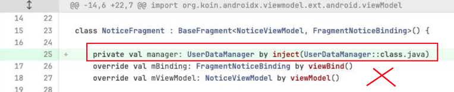

# 坑

1. 自定义的ViewGroup不继承自ConstraintLayout
```text
这会导致xml中嵌套层级过深，导致卡顿
```

2. 没必要的Fragment/View提前加载了
```text
比如一个xml中存在Winningfragment，子fragment只在胜利状态时才需要加载，而不是一开始就加载，
正确的做法时胜利的时候动态加载，胜利结束移除，否则影响fragment的加载速度
```
```text
同样的道理，view也存在过度加载，常见的比如遮罩，只在某个阶段才会加载遮罩，不是一开始就加载。
否则遮罩图片太多（特别在RecycleView中）会影响fragment的加载速度
```

3. fragment之间的通信
```text
常见的做法是使用EventBus，EventBus作为全局变量，容易滥用且不好跟踪，数据流的发送和接受很难定位
推荐的做法：
（1）使用SharedViewModel，fragment之间使用共享的viewModel
（2）使用内存级别Room数据库，fragment的viewModel对Room操作和监听
```

4. UI层操作数据   
- UI层只应该跟ViewModel交互
   
  
  ⚠️ UI層不要有資料層的東西注入，也不應該有資料的業務邏輯

- UI层避免View之间直接操作
```text
常见的错误是：btn点击事件中对其他view进行更改，比如textView。如果收到网络，也需要更改textView。
那么textView的改动点就不唯一了，textView和btn，网络强耦合了。

正确的做法是使用liveData/flow的方式解耦：
textView通过监听liveData/flow来更改，其他操作liveData/flow
```

