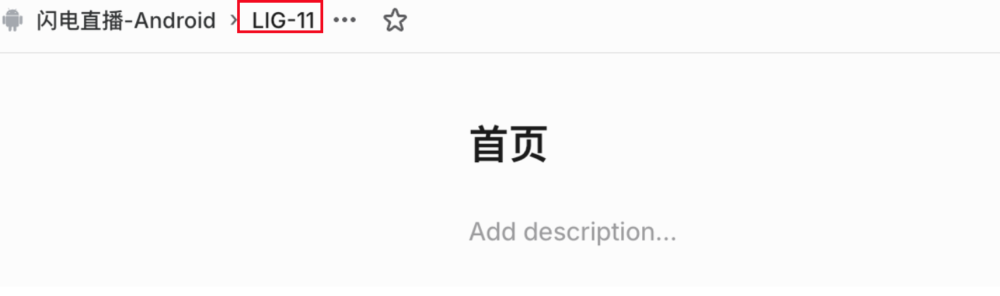
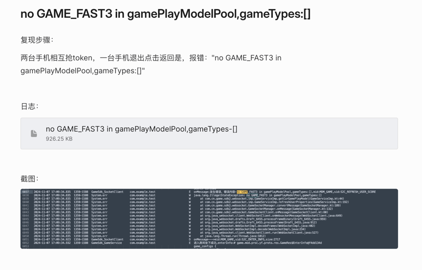
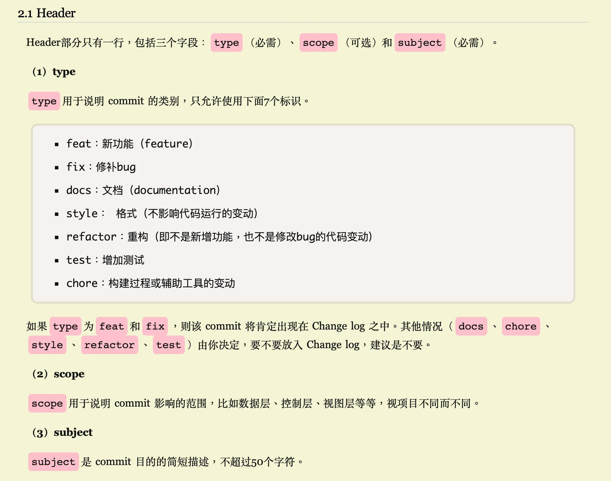
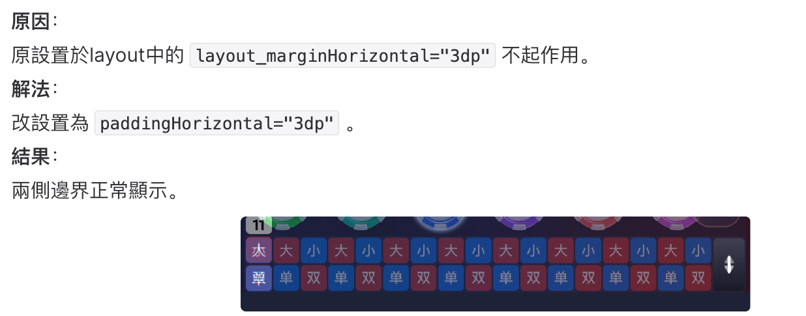
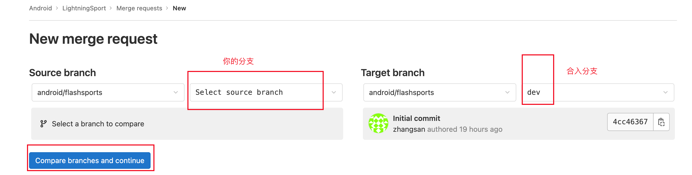
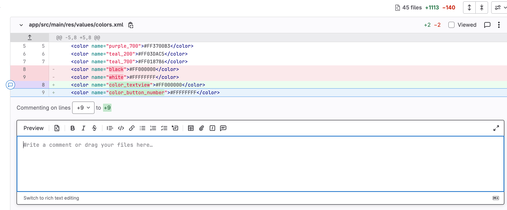
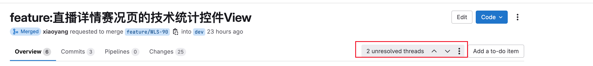
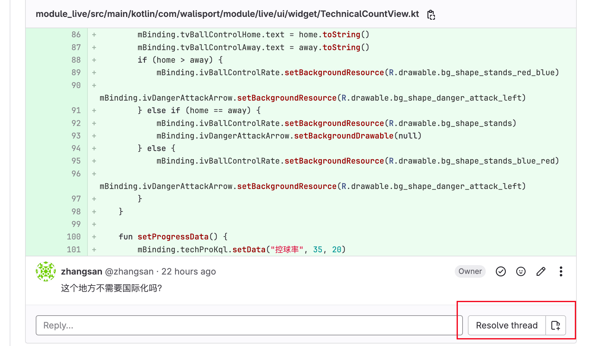
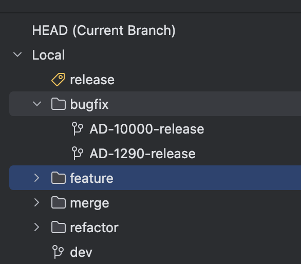

# 开发规范


## 日报规则

- 每天工作前发在群里

```tex
昨日：1.增加fragment跳转时的默认动画。
今日：1.增加BaseWebFragment加载网页 2.跟进闪电体育
风险：无
```

- 每周5例会：11点


## 开发

### 建linear任务

#### 生成linear id

  


 

 

生成一个任务ID：比如**LIG-11**，任务状态默认是**backlog**


#### 填写linear描述

feature格式如下：

```
功能：xxxx
```

bug格式如下：

```
复现步骤：

日志：

截图/视频(可选)
```

例:

  

### [创建分支](#创建分支)

根据任务ID创建开发分支，比如任务是功能，创建"feature/LIG-11-dev"分支。

*解释：feature表示功能，LIG-11表示linear id。dev表示要合入的分支。*


#### commit规范

创建完分支，开始代码开发，开发由一笔笔commit组成。下面是commit规范。


##### 关键词

提交commit时，请指明提交的关键词。关键词如下：

```tex
feature/feat：特性

bugfix/fix：bug修复

hotfix:   热修复,适用于紧急修复

refactor：重构

chore: 杂项，比如更新版本号
```

例：

```shell
bugfix:
1. 在「更多-切换游戏」里每个游戏之间的上下间距与UI设计图不一致，且字段缺少“在线” #35
2. 「更多-帮助」弹窗下滑消失动画速度较快（未达到iOS效果）#42
3. 对筹码,DrawHistory使用OverScrollDecoratorHelper增加弹性动画
```

- 参考：



##### 原子化提交

一个功能/bug点一次commit，不要commit包含多个修改点。

比如：解决内存泄漏的时候，又重构了，那就应该至少两个commit，一个重构commit，一个解决commit


### 合入代码

#### 在linear上填写实现详情

feature格式：

```text
实现步骤：
```

解bug格式

```
原因：bug原因

解法：解决方案

结果：自测步骤及结果
```

 


####  merge request

所有提交都要走merge request，==严禁直接push代码到仓库，代码经过检视后才能merge==

Merge requst流程如下: 

1. 创建merge request

    

    

1. 提交时填写问题内容：linear_id + 原因 + 解法 + 结果

 

2. 指定检视（建议两个人），其中reviewer拥有merge权限，目前是我。

    

3. 检视者检视人发现问题，comment，每次comment会产生一条"unResolved thread"。没有问题或者问题都**resolved点击approved**

     

      

4. 提交人回复并修改，检视人检视没问题后点击"Resolved thread"

   

5. 所有问题都解决了，merge者才会merge

    


## 分支管理

```
main: 主分支（保护分支）
dev: 开发分支（保护分支）
release: 发布分支（保护分支）
feature: 功能分支
bugfix: 修bug分支
merge: 合并分支
refactor: 重构分支
```

### 保护分支

保护分支不能直接push，只能走mr。

目前main，dev，release是保护分支


### 创建分支

每次基于**dev分支**创建分支

根据代码特点在"bugfix/","feature/"目录下新增分支。

分支名为Linear的问题ID开始，比如"bugfix/AD-1290-release"表示linear上的问题单AD-1290要merge到release分支

 


## 代码

### 命名规范

```
类名：驼峰原则

文件资源： fragment_,activity_,layout_,item_

ID:tv_,btn_
```

### 注释规范

类名至少一个注释: author, date,description

```kotin
/**
 * @author: zhangsan
 * @date: 2025/4/8 18:08
 * @description: Navigation的扩展
 */
```

方法注释：
```kotin
/**
 * 监听其他fragment发送过来的result
 *
 * @see sendResult （可选）
 * @param key
 * @param onResult
 * @param fromId navigation.xml中定义的fragmentID。默认为当前fragment
 */
 fun <T> Fragment.observeResult(key: String, onResult: (T) -> Unit, fromId: Int? = null) {}
```


